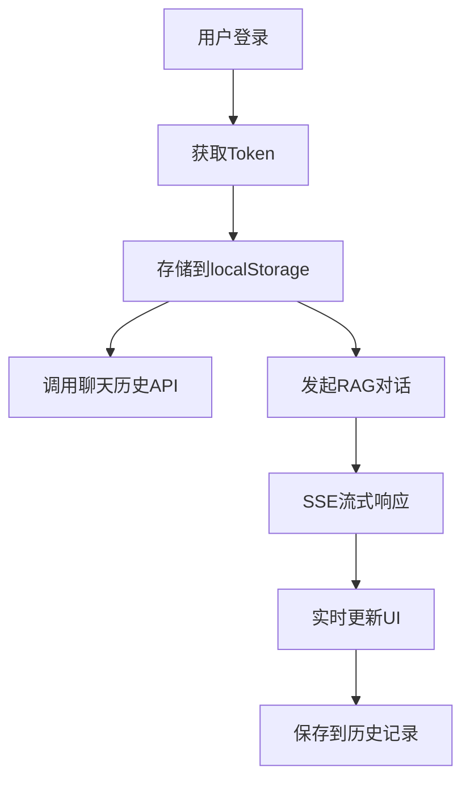

# LumiLove 后端 API 文档

## 概述

LumiLove 后端采用微服务架构，提供用户认证、聊天历史管理和RAG对话等核心功能。本目录包含了现有后端接口的完整文档。

## 服务架构

### 主要服务

| 服务名称 | 基础URL | 端口 | 描述 |
|---------|---------|------|------|
| 主后端服务 | `http://54.206.37.109:8080/api` | 8080 | 用户认证、聊天历史 |
| 备用后端 | `https://54.206.37.109:8443/api` | 8443 | 主服务备用地址 |
| RAG对话服务 | `https://54.206.37.109:8001/api` | 8001 | AI流式对话服务 |

### 架构特点

- **服务分离**: 认证服务与AI对话服务分离
- **流式传输**: RAG服务支持Server-Sent Events (SSE)
- **HTTPS安全**: RAG服务强制使用HTTPS协议
- **Token认证**: 所有服务统一使用Bearer Token认证

## API 文档目录

### 📁 [用户认证 API](./auth.md)
- **登录接口**: `POST /auth/login`
- **登出接口**: `POST /auth/logout`  
- **用户信息**: `GET /auth/me`
- **Token管理**: JWT认证机制
- **本地存储**: localStorage数据管理

### 📁 [聊天历史 API](./chat-history.md)
- **获取历史**: `GET /chat/history/{characterId}`
- **清除历史**: `DELETE /chat/history/{characterId}`
- **数据模型**: ChatHistoryItem接口定义
- **前端集成**: 数据转换和本地缓存

### 📁 [RAG对话 API](./rag-chat.md)
- **流式对话**: `POST /chat/message/stream/authenticated`
- **实时传输**: Server-Sent Events协议
- **会话管理**: Session ID生成规则
- **UI状态**: 思考状态和加载提示

## 快速开始

### 1. 认证流程

```typescript
// 1. 用户登录
const response = await fetch('http://54.206.37.109:8080/api/auth/login', {
  method: 'POST',
  headers: { 'Content-Type': 'application/json' },
  body: JSON.stringify({ email, password })
});

const { accessToken, user } = await response.json();

// 2. 存储认证信息
localStorage.setItem('token', accessToken.replace(/^Bearer\s+/, ''));
localStorage.setItem('user', JSON.stringify(user));
```

### 2. 获取聊天历史

```typescript
const token = localStorage.getItem('token');
const response = await fetch(`http://54.206.37.109:8080/api/chat/history/1`, {
  headers: {
    'Authorization': `Bearer ${token}`,
    'HTTP-Referer': 'https://main.d3m01u43jjmlec.amplifyapp.com/',
    'X-Title': 'Lumilove'
  }
});

const { histories } = await response.json();
```

### 3. 流式对话

```typescript
const response = await fetch('https://54.206.37.109:8001/api/chat/message/stream/authenticated', {
  method: 'POST',
  headers: {
    'Content-Type': 'application/json',
    'Authorization': `Bearer ${token}`
  },
  body: JSON.stringify({
    user_id: "12345",
    session_id: "user_12345_character_1",
    message: "Hello!"
  })
});

// 处理流式响应
const reader = response.body?.getReader();
// ... SSE处理逻辑
```

## 通用配置

### 请求头规范

```http
# 认证服务和历史服务
Content-Type: application/json
Authorization: Bearer {token}
HTTP-Referer: https://main.d3m01u43jjmlec.amplifyapp.com/
X-Title: Lumilove

# RAG对话服务
Content-Type: application/json
Authorization: Bearer {token}
```

### 错误处理

所有API使用统一的错误响应格式：

```typescript
interface ErrorResponse {
  success: false;
  error: string;
  message: string;
  statusCode?: number;
}
```

### 状态码规范

| 状态码 | 含义 | 处理方式 |
|--------|------|----------|
| 200 | 成功 | 正常处理 |
| 401 | 未授权 | 跳转登录页面 |
| 403 | 权限不足 | 显示错误信息 |
| 404 | 资源不存在 | 显示404页面 |
| 429 | 请求过频 | 显示限制提示 |
| 500 | 服务器错误 | 显示错误页面 |

## 数据流图



## 前端集成

### 配置文件

- `lib/config.ts` - API基础配置
- `lib/api.ts` - API调用封装
- `app/lib/axios.ts` - Axios实例配置
- `app/services/auth.service.ts` - 认证服务类

### 本地存储规范

```typescript
// localStorage存储项
'token'           // JWT认证令牌
'user'            // 用户基本信息
'isLoggedIn'      // 登录状态标识
'recentChats'     // 最近聊天列表
'chatCharacters'  // 用户创建的角色
```

## 开发注意事项

### 1. 认证管理
- Token可能包含"Bearer "前缀，需要处理
- 401错误表示需要重新登录
- 多处认证逻辑需要统一管理

### 2. 数据一致性
- 聊天历史存在本地和服务端双重存储
- 用户ID获取策略需要标准化
- 消息ID生成避免冲突

### 3. 性能优化
- RAG对话使用流式传输，注意内存管理
- 实现请求取消机制
- 合理使用本地缓存

### 4. 错误处理
- 网络错误重试机制
- 用户友好的错误提示
- 日志记录和监控

## 版本历史

- **v1.0** - 基础认证和聊天功能
- **v1.1** - 添加RAG流式对话
- **v1.2** - 优化错误处理和性能

## 相关资源

- [角色管理 API 文档](../lib/characters-api.md) - 角色相关接口设计
- [前端实现文档](../CLAUDE.md) - 项目架构和开发规范
- [部署配置](../amplify.yml) - AWS Amplify部署配置

---

**注意**: 本文档基于现有代码分析生成，如有接口变更请及时更新文档。
